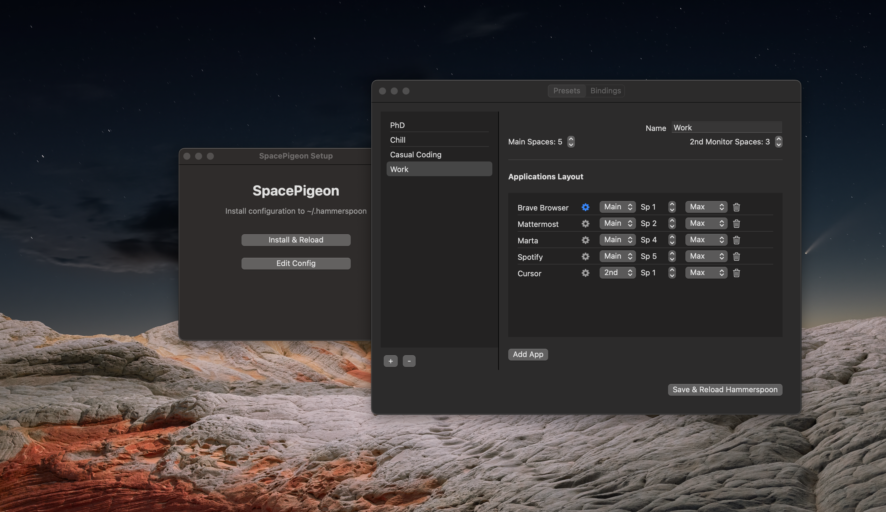

# SpacePigeon: Saved Workspaces for macOS

<div align="center">
  
</div>

**SpacePigeon** is a native macOS app (powered by Hammerspoon) that lets you define *workspaces* — which apps open, which desktop spaces they go to, and how windows are arranged.

Effortlessly transition between workflows. SpacePigeon instantly orchestrates your applications, windows, and displays into the perfect environment for any task with a single click or hotkey.

## Features

- 🚀 **One-Click Setup**: Installs everything automatically. If you don't have Hammerspoon, SpacePigeon will download and install it for you.
- 🎨 **Visual Configuration**: A full native UI to manage your workspaces. No need to touch Lua code manually.
- 🖥 **Multi-Monitor Support**: Configure spaces and app layouts for both your Main and Secondary monitors.
- ⚡️ **Smart App Launching**:
  - **Browser Mode**: Launch browsers with specific startup URLs.
  - **Deep Links**: Open apps to specific content (e.g., Notion pages, Spotify playlists, or custom URL schemes).
- 🪟 **Window Management**: Automatically position windows:
  - Maximize
  - Split Left / Split Right
- ⌨️ **Hotkeys**: Bind global hotkeys to trigger specific presets instantly.
- 📑 **Presets**: Create multiple workspace states (e.g., "Work", "Chill", "Stream") and switch between them.

## Installation

### Option 1: Download App (Recommended)
1. Go to the **[Releases](../../releases)** page.
2. Download `SpacePigeon.zip`.
3. Unzip the file.
4. Run **SpacePigeon.app**.
5. Click **"Install & Reload"**.

### "Unidentified Developer" Warning?
If macOS prevents the app from opening because it "cannot be verified":

1. Click **Done** (or Cancel) on the warning dialog.
2. Open **System Settings**.
3. Go to **Privacy & Security**.
4. Scroll down to the **Security** section.
5. Click the **Open Anyway** button next to *"SpacePigeon.app was blocked..."*.
6. Click **Open** in the final confirmation.

*(This is required because the app is open-source and not signed with a paid Apple Developer certificate).*

### Option 2: Build from Source
If you prefer to build it yourself:

1. Clone the repository:
   ```bash
   git clone https://github.com/yourusername/spacepigeon.git
   cd spacepigeon
   ```
2. Run the build script:
   ```bash
   ./build_app.sh
   ```
3. Open the generated app:
   ```bash
   open SpacePigeon.app
   ```

## Configuration

Launch SpacePigeon and click **"Edit Config"** to open the configuration editor.

### Presets Tab
Manage your workspace layouts here.
- **Spaces**: Define how many Desktop Spaces you want on your Main and Secondary monitors.
- **Applications Layout**: Add apps to the list.
  - **Name**: The application name (e.g., "Safari", "Terminal").
  - **Monitor**: Choose "Main" or "2nd".
  - **Space**: The space number (1-based index) on that monitor.
  - **Position**: Maximize, Left, or Right.
  - **Gear Icon ⚙️**: Access advanced settings:
    - **Is this a Browser?**: Check this to enable startup URL support.
    - **URL**: Enter a web URL (for browsers) or a deep link (for other apps) to open on launch.

### Bindings Tab
Set up global hotkeys to trigger your presets.
- **Modifiers**: `cmd`, `alt`, `ctrl`, `shift` (comma separated).
- **Key**: The key to press (e.g., `S`, `1`, `F`).
- **Preset**: Select which preset this hotkey should activate.

After making changes, click **"Save & Reload Hammerspoon"** to apply them immediately.

## Requirements
- **[Hammerspoon](https://www.hammerspoon.org/)** (The app will automatically download and install this to `~/Applications` if it is not found).

## License
MIT
